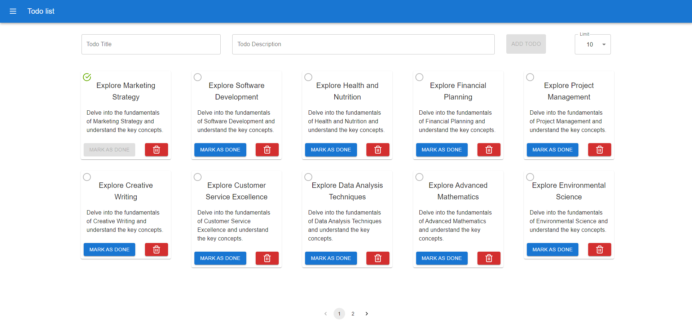

## Todo list

A Todo list web app that allows users to conveniently create, organize, and manage their grocery lists online from any device.

## Libraries Used

In this project, I've used the following libraries:

- **mui/material**: Material UI components for rich UI design. [mui/material](https://mui.com/)
- **react-toastify**: Easy toast notifications for React applications. [react-toastify](https://fkhadra.github.io/react-toastify/)
- **react-lucid**: A set of clear and elegant React icons for building visually appealing interfaces. [react-lucid](https://www.npmjs.com/package/react-lucid)

## Snapshots

